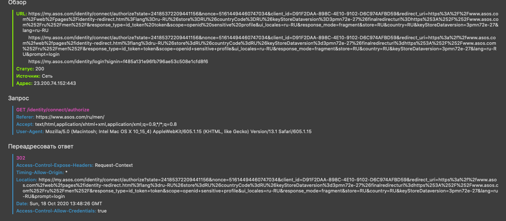

##### Socials Authentication

###### reddit.com
After authentication, the website was reloaded and the Request and Response were refreshed, while scrolling the feed and navigating to posts, the request / response is not updated.

###### asos.com

After loading an authentication page there were several requests, responses and response redirections. The reCAPTCHA appeared without updating requests and responses.

